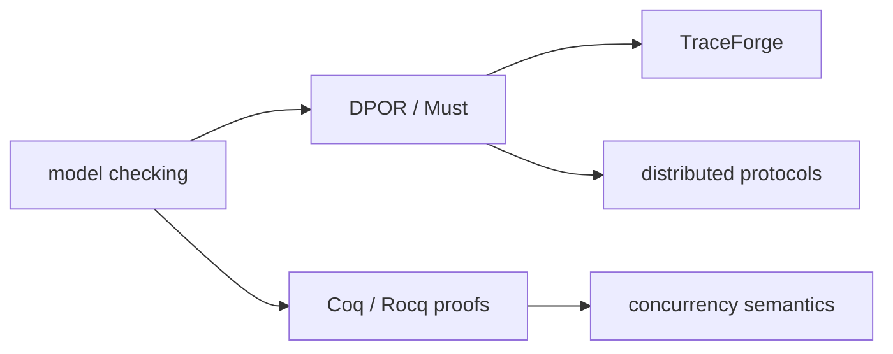

<p align="center">
  
</p>

CS master's student in Genoa, research intern at MPI-SWS. I look for races in concurrent programs, and for proofs that there are none. Sometimes both at once.

---

### `// currently`

```text
$ whoami
> sahar ramezani. cs master's @ unige, research intern @ mpi-sws
$ currently_doing
> extending DPOR with timestamps in TraceForge
$ also
> teaching Coq to admit when it does not know
$ uptime
> 3 espressos, 1 admitted lemma, 0 races on purpose
```

---

### `// what I work on`



At MPI-SWS I work with Prof. Rupak Majumdar and Prof. Arnaud Sangnier on DPOR and the Must algorithm. The tool is **TraceForge**, a Rust engine for stateless model checking of distributed systems. The phrase "stateless model checking" sounds harder to explain at parties than it actually is. Short version: run a concurrent program over enough interleavings to be confident the bug is not there, without running all of them. A preprint lives on [arXiv](https://arxiv.org/abs/2504.18953).

---

### `// shipped, outside academia`

- Tender Offer System for the oil sector
- Grant Request System for a Ministry of Science
- Oracle Forms and PL/SQL modules across several internal tools
- A project management platform that ended up being sold to a company

---

### `// the stack`

**languages**  


**verification & theory**  


**infra & tools**  


---

### `// one theorem, mostly admitted`

```coq
Theorem sahar_likes_concurrency : forall p, concurrent p -> exists b, found_by_DPOR b p.
Proof.
  intros p Hc.
  induction Hc.
  - (* base case: trivially fine *)
  - (* inductive case: probably fine, it is 2 a.m. *)
Admitted.
```

---

### `// the numbers, lightly`

<p>
  <a href="https://github.com/SaharRamezani">
    
    
  </a>
</p>

---

### `// elsewhere`

<p>
  <a href="https://github.com/SaharRamezani">
    
  </a>
  &nbsp;
  <a href="https://www.linkedin.com/in/sahar-ramezani-jolfaei/">
    
  </a>
  &nbsp;
  <a href="https://scholar.google.com/citations?user=5M3m52EAAAAJ&hl=en">
    
  </a>
  &nbsp;
  <a href="mailto:6709190@studenti.unige.it">
    
  </a>
  &nbsp;
  <a href="https://arxiv.org/abs/2504.18953">
    
  </a>
</p>

<sub>based in Italy. English C1, Italian B1, German A1. international students' representative at UniGe.</sub>
